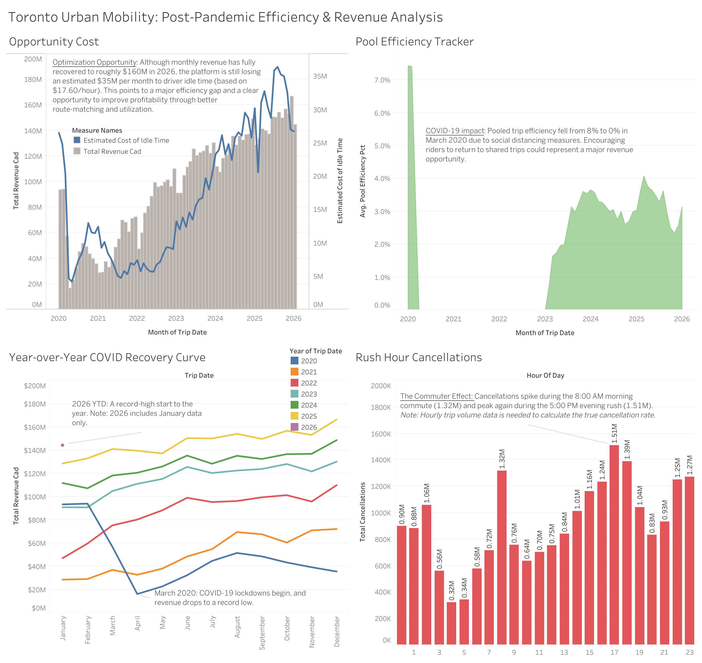

# Toronto Urban Mobility: Big Data ETL & Efficiency Analysis
**Author:** YuTong Lin
**Interactive Dashboard:**  
[](https://public.tableau.com/views/TorontoUrbanMobilityOperationalEfficiencyAnalysis/TorontoUrbanMobilityPost-PandemicEfficiencyRevenueAnalysis?:language=en-US&:sid=&:redirect=auth&:display_count=n&:origin=viz_share_link)
*< Click the image above to view the interactive dashboard on Tableau Public >*

## Overview
This project is an end-to-end data engineering and business intelligence analysis of Toronto's urban mobility network from 2020 to 2026.

Using Python and SQLite, I processed a large-scale public dataset containing **73 CSV files**, over **60 GB** of raw data, and more than **302 million rows**. The goal was to build a local ETL pipeline capable of processing enterprise-scale data on a standard machine, then transform the raw records into lightweight KPI outputs for Tableau.

## Tech Stack
- **Python:** Pandas, Glob
- **Database:** SQLite
- **Analysis:** SQL
- **Visualization:** Tableau Public
- **Version Control:** Git / GitHub

## Key Insights
### 1. Idle Time Remains a Major Profitability Gap
Although post-pandemic revenue recovered strongly, vehicle idle time also remained high. Using Ontario's minimum wage benchmark (**$17.60/hour**), I estimated that idle vehicle time represented roughly **$35M CAD per month** in lost opportunity by early 2026.

This suggests that revenue recovery alone does not mean the network is operating efficiently. Route-matching and dispatch optimization remain major profitability levers.

### 2. Cancellations Reflect Different Operational Problems
Cancellations peak during major commuting windows, with the highest total cancellations occurring at **17:00 (5:00 PM)** and a secondary spike at **08:00 AM**.

The dataset also separates **driver-cancelled trips** and **passenger-cancelled trips**, which likely reflect different operational issues. Passenger cancellations may point to rider-side friction such as long waits, while driver cancellations may indicate pickup inefficiency, low-value trips, or weak driver coverage.

This suggests that rush-hour cancellation pressure is more likely a **scale problem**, while late-night cancellation pressure may be more of a **coverage problem**.

> **Note:** The source data does not include a direct trip-request field, so this project does not calculate a full request-based cancellation rate. Instead, it analyzes cancellation pressure using recorded trip outcomes in the dataset.

### 3. Pooled Trips Have Not Fully Recovered
Before March 2020, pooled-trip efficiency consistently ranged between **7-9%**. It dropped to **0%** under pandemic restrictions and recovered to only **3-4%** by 2026.

This suggests pooled service has not fully regained rider trust or habitual usage. A likely barrier is service uncertainty, especially around detours and travel time.

Potential operating levers include:
- setting a **maximum delay guarantee**
- offering a **guaranteed upfront discount**
- focusing pooled incentives on dense commuter corridors

## Data Quality Notes
Because this project relies on multi-year trend analysis, known source-data gaps were documented and excluded or flagged where appropriate. This improves transparency and helps prevent misleading interpretation of longitudinal trends.

### Missing raw data
**Trip data only**
- 2021-10-07
- 2021-10-08
- 2021-10-09
- 2021-10-14
- 2021-10-15
- 2021-10-16

**Trip data and vehicle operating data**
- 2025-05-26
- 2025-05-27
- 2025-05-28

These dates should be treated as **incomplete source records** rather than confirmed business declines.

## Project Structure
```text
toronto-urban-mobility/
│
├── Dashboards/                         # Local Tableau workbook files
├── images/                             # Dashboard screenshots for documentation
├── sample_data/                        # Lightweight raw CSV subsets for script testing
├── Scripts/                            # Jupyter notebooks for data processing
│   ├── 01_etl_extract_load.ipynb       # Batch loads 73 raw CSV files into SQLite
│   └── 02_kpi_analysis.ipynb           # SQL queries aggregating 302M rows
├── kpi_1_cancellations_by_hour.csv     # Aggregated output (24 rows representing hours 00 to 23)
├── kpi_2_revenue_and_idle.csv          # Aggregated output (daily, Jan 2020–Jan 2026)
├── kpi_3_pooled_efficiency.csv         # Aggregated output (daily, Jan 2020–Jan 2026)
├── .gitignore                          # Excludes the intentionally untracked 60GB raw dataset
├── README.md                           # Project documentation and key insights
└── requirements.txt                    # Python dependencies (pandas, jupyter)
```
**Please note:** To adhere to GitHub's file size limits and best practices, the 60GB raw database (toronto_transportation.db) and complete raw CSVs are excluded via .gitignore. Only the scripts, sample data, and aggregated outputs are tracked.

## Data Source & Reproducibility
The raw dataset used in this project is publicly available through the **City of Toronto Open Data Portal**.
- **Dataset:** Vehicle Operating Data / Private Transportation Companies
- **Source:** [Toronto Open Data Portal](https://open.toronto.ca/dataset/private-transportation-companies-vehicle-operating-data/)

To reproduce this project:
1. Download the raw CSV files from the portal.
2. Store them in the expected local raw-data folder.
3. Run `01_etl_extract_load.ipynb` to load the data into SQLite.
4. Run `02_kpi_analysis.ipynb` to generate the KPI outputs used in Tableau.